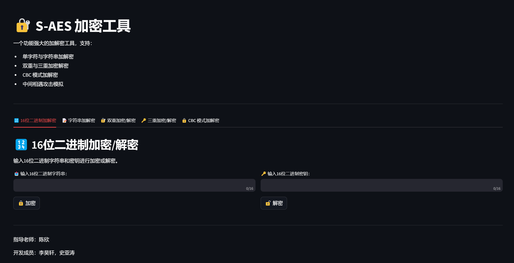

# S-AES 用户指南

## 1.引言

### 1.1项目背景

随着信息安全技术的不断发展，数据加密和解密已经成为保护个人隐私和企业机密的核心技术之一。对称加密算法作为加密技术的重要组成部分，在数据安全通信中扮演着至关重要的角色。S-AES（Substitution AES）是一种简化版的AES（Advanced Encryption Standard，高级加密标准）算法，旨在以更高效的方式实现数据加密和解密操作。

AES作为当前最为广泛使用的加密标准，具有较高的安全性和性能，但由于其复杂的算法结构和较大的计算量，学习和实现上对于初学者存在一定的挑战。S-AES通过减少一些AES的结构和操作，使得其更适合教学和学习，帮助用户理解加密算法的基本原理和实现机制。

本项目旨在通过实现S-AES加密算法，帮助学习者掌握对称加密算法的基本构造，同时也为后续深入学习更复杂的加密算法（如标准AES）奠定基础。

### 1.2变量解释

- AES：**高级加密标准（Advanced Encryption Standard）**，又称Rijndael[加密法](https://baike.baidu.com/item/加密法/9684302?fromModule=lemma_inlink)，是[美国联邦政府](https://baike.baidu.com/item/美国联邦政府/8370227?fromModule=lemma_inlink)采用的一种区块加密标准。
- S-AES：**简化版高级加密标准（Simplified Advanced Encryption Standard）**，是一个基于AES算法的简化版本，旨在提供更快的执行速度和更简单的实现。
- S-BOX：**代换盒（Substitution Box）**是一种非线性函数，用于加密算法中的替代操作。S-BOX的作用是将输入的每个字节映射为一个新的字节，从而实现信息的混淆。S-BOX是加密算法中关键的组件之一，它的设计对于算法的安全性至关重要。在S-AES中，S-BOX用于将明文数据的每个字节与S-BOX进行替换，以增加加密的复杂度，防止攻击者通过分析输入与输出之间的关系来破解加密。
- NS：**半字节代换（Nibble Substitution）**操作是通过S-BOX对每个4位二进制（即一个半字节或nibble）进行代换处理。这种代换增加了加密的非线性特性，有助于提高算法的安全性。NS操作通常在加密的轮操作中执行，目的是将原始数据的每个nibble替换为经过预先定义的值，从而打破数据的可预测性。
- GF：**伽罗瓦域（Galois Field）**是数学中的一个有限域，广泛应用于密码学，特别是在分组加密和错误校验等领域。在S-AES中，GF(2^8)表示一个包含256个元素的有限域，所有的加密操作都在该域内进行。
- AK：**加法密钥（Additive Key）**将密钥与数据进行异或操作。S-AES算法采用对称密钥加密机制，即加密和解密使用相同的密钥。在每一轮的加密过程中，AK操作通过将当前数据块与轮密钥进行异或运算，增加了加密的复杂度。此步骤不仅增强了数据的安全性，还帮助实现了密钥的扩展，确保加密过程中的每一轮都具有足够的混淆效果。
- SR：**行移位（Shift Rows）**用于增强数据的混淆性。在SR步骤中，数据的行会按照特定规则进行移位，目的是打破数据的局部结构，提高加密的复杂性。
- MC：**列混淆（Mix Columns）**旨在进一步增强加密数据的扩散性。MC操作通过对每一列数据进行线性变换，将列中的每个字节与其他字节进行混合，确保加密后的数据在不同的输入变化下具有更复杂的输出。
- IV：**初始化向量（Initialization Vector）**在加密过程的开始阶段与密钥共同使用，用于确保相同的明文在不同的加密操作中生成不同的密文。IV的作用是为每次加密过程提供一个独特的输入，防止相同的输入数据在重复加密时产生相同的输出，从而提高加密的安全性。
- CBC：**密码块链接模式（Cipher Block Chaining）**是一种块加密模式，用于增强加密过程的安全性。在CBC模式下，明文被分割成固定大小的块，每一块在加密之前都会与前一个密文块进行异或操作（第一个明文块则与初始化向量IV进行异或）。这种操作使得相同的明文块在不同的加密过程中产生不同的密文，从而有效地防止了加密模式的重复性攻击。
- MITM attack：**中间相遇攻击（Meet-in-the-middle attack）** 是一种针对加密算法的攻击方法，通常用于暴力破解双重加密（或多重加密）算法，尤其是像双重DES（Double DES）这类加密机制。该攻击的关键思想是通过在加密过程的两端同时进行搜索，减少需要枚举的密钥组合数，从而提高破解的效率。

##  2.运行环境

### 2.1硬件

- CPU:AMD Ryzen 7 5800H with Radeon Graphics            3.20 GHz
- GPU:NVIDIA GeForce RTX 3050 Laptop GPU

### 2.2软件

- 操作系统：Windows 11
- 开发环境：Pycharm 2024.1.3
- Python版本：3.11.10
- Python库：streamlit

## 3.使用说明

### 3.1安装与初始化

#### 3.1.1安装Pycharm

- 如果您没有安装Pycharm，请先下载安装[Pycharm](https://www.jetbrains.com/pycharm/download/?sectio)。你可以在Bilibili上查找安装教程或查看官方文档。

#### 3.1.2下载代码

- 您可以从此[链接](https://github.com/Yhaokaf/S-DES/archive/refs/heads/master.zip)下载我们的代码压缩包,将其解压后部署到您的计算机中运行。

- 下载完成后，进入您的项目终端，输入`streamlit run front.py`并运行，进入S-AES加解密UI。

  

### 3.2输入输出

#### 3.2.1输入格式

- 16位二进制加解密：输入16位二进制字符串和密钥进行加密或解密。

- 字符串加密/解密：输入任意字符串和密钥进行加密或解密。密钥为是单字符或16位二进制。
- 双重加密/解密：输入16位二进制明文/密文， 输入32位二进制密钥。
- 三重加密/解密：输入16位二进制明文/密文，输入48位二进制密钥。
- CBC 模式加密/解密：输入二进制明文（长度为16的倍数），输入16位二进制密钥。

#### 3.2.2输出格式

- 16位二进制加解密：输出16位二进制字符串。

- 字符串加密/解密：输出为字符串。
- 双重加密/解密：输出16位二进制明文/密文。
- 中间相遇攻击：输出为所有可能的16位密钥组合。
- 三重加密/解密：输出16位二进制明文/密文。
- CBC 模式加密/解密：输出与二进制明文流（长度为16的倍数）相同长度的明文/密文。

## 4.运行说明

### 4.1十六位二进制加密/解密

#### 4.1.1加密模块

- 明文（16位二进制）：0000000000000000

- 密钥（16位二进制）：1010101010101010

- 密文（16位二进制）：0010010101101100

- 交叉验证：

  

#### 4.1.2解密模块

- 密文（16位二进制）：1100001000000011

- 密钥（16位二进制）：1011010101011100

- 明文（16位二进制）：1111111111111111

- 交叉验证：

  

  

  

### 4.2字符串加密/解密

#### 4.2.1密钥为单字符

正反向进行验证：

- 明文（字符串）：Yhaokaf

- 密钥（单字符）：?

- 加密结果：著喯斫얪䖮斫

- 解密结果：᎝蔄唇㔋씉唇픊

  

  

  

  

  

#### 4.2.2密钥为16位二进制

正反向进行验证：

- 明文（字符串）：Condre

- 密钥（16位二进制）：1010101010101010

- 加密结果：蹚ෟ㷙뷝ꊀ淒

- 解密结果：蔨ʟ느ꊗ泳튞

  

  

  

  

### 4.3双重加密/解密

- 明文/密文（16位二进制）：1010000111111111
- 密钥（32位二进制）：11111111000000000011111100000000
- 双重加密结果：0101100111110010
- 双重解密结果：1010000111111111
- 中间相遇攻击：

**K1**: `1101110011111001` , **K2**: `0000000000000001`

**K1**: `1101110100101001` , **K2**: `0000000000000010`

**K1**: `0011001100001011` , **K2**: `0000000000000011`

**K1**: `0001100000101101` , **K2**: `0000000000000101`

**K1**: `1101000000010111` , **K2**: `0000000000000000`

### 4.4三重加密/解密

- 明文/密文（16位二进制）：1110101010101011

- 密钥（ 48位二进制）：010010100010101010100101001010100110101010100000

- 双重加密结果：0100011110101110

- 双重解密结果：1110101010101011

  

  

  

  

### 4.5CBC模式加密/解密

- 明文/密文（二进制16n位）：1101011100101010110101110010101011010111001010101101011100101010
- 密钥（ 16位二进制）：1101010100000110
- CBC 加密结果：1111000010101010001000010010101101111001110011011101101111001111
- 篡改后的密文：1010101010101010001000010010101101111001110011011101101111001111
- 解密原密文结果：1101011100101010110101110010101011010111001010101101011100101010
- 篡改密文解密结果：1100110000110110100011010010101011010111001010101101011100101010

用加密得到的密文进行解密得到原明文。

模拟篡改密文（可下载原密文和篡改后密文）：

篡改密文解密结果(与原密文相同)：

此外，我们还提供了下载密文的方式，点击对应按钮即可下载有对应密文的txt文件。

## 5.联系我们

### 5.1关于我们

-  课程名称：信息安全导论
- 教学班级：992987-003
- 任课教师：陈欣
- 单位：重庆大学大数据与软件学院
- 主管部门：重庆大学大数据与软件学院2022级人工智能
- 小组成员：史亚涛 李昊轩

### 5.2联系方式

邮箱：

- 1205980441@qq.com 
- Yhaokaf@gmail.com 

